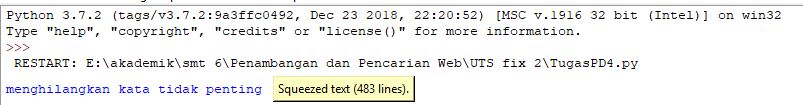
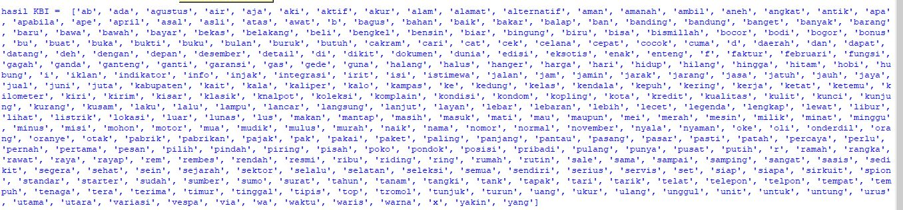
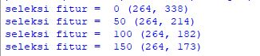
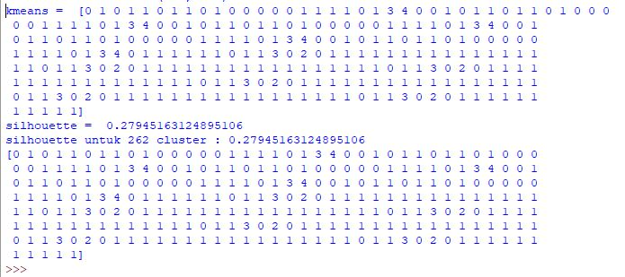

##### Evaluasi 

Crawl data dari website <https://www.jualmotorbekas.com/> mendapatkan 264 artikel dan banyak kata yang telah diproses menjadi 173 kata. serta dari metode yang telah dipakai pada code diatas dapat mengambil kata dari sekian banyak artikel/dokumen website yang baku sesuai KBBI dan mengelompokkannya berdasarkan clustering yang diinginkan 

###### Hasil Running

mengambil data dan menghilangkan kata tidak penting(kata imbuhan)

hasil seleksi kata dengan KBI

hasil seleksi fitur

hasil k-means dan silhouete